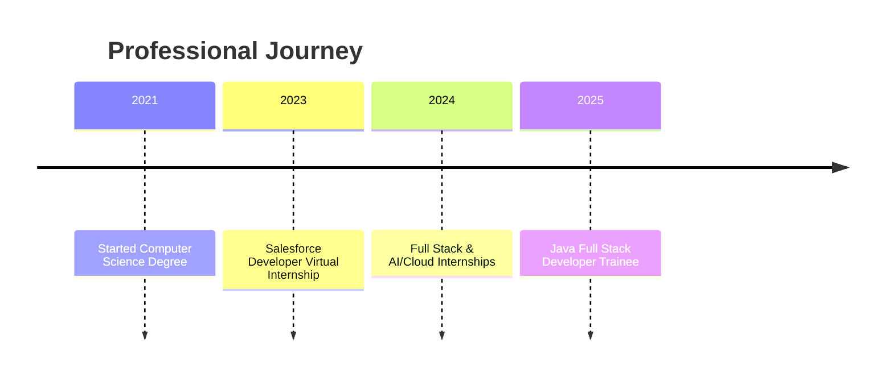

# 🚀 Vamshi Manthri | Java Full Stack Developer & Problem Solver

  <!-- Fancy Header with Gradient Effect -->
  

  <!-- Profile Info Badges -->
   
  

    
    
    
  

  <!-- Short Tagline -->
  <h3>👋 Hi there! I'm Vamshi Manthri, a passionate Software Developer and Trailhead Ranger 🚀</h3>

## 💡 Personal Motto

> **Transforming complex problems into elegant solutions through code. Dedicated to building innovative applications that make a difference.**

## 🌟 About Me

<table>
  <tr>
    <td width="60%">
      
As a Java Full Stack Developer Trainee with a strong foundation in programming, I'm passionate about building dynamic, responsive applications. My journey is driven by curiosity and a desire to create software solutions that solve real-world problems.

    </td>
    <td width="40%">
      <h3>🎓 Education</h3>
      <ul>
        <li>Bachelor of Technology in Computer Science</li>
        <li>Jayamukhi Institute of Technological Sciences (2021-2025)</li>
      </ul>
    </td>
  </tr>
</table>

## 👨‍💻 Quick Overview

<table>
  <tr>
    <td width="50%">
      <h3>🎯 Focus</h3>
      
Building robust applications using Java and web technologies, with a special interest in backend development and problem-solving.

    </td>
    <td width="50%">
      <h3>📊 Highlights</h3>
      <ul>
        <li>🏆 Java Full Stack Developer Trainee</li>
        <li>💻 Completed multiple virtual internships</li>
        <li>🧩 250+ Problems solved on CodeChef</li>
      </ul>
    </td>
  </tr>
</table>

### 🔧 Skill Expertise

| Skill Category | Proficiency | Highlights |
|---------------|-------------|------------|
| Java Programming | ███████████████ 90% | Core Java, Advanced Java |
| Web Development | ██████████████ 85% | HTML, CSS, JavaScript |
| Database Management | ████████████ 75% | MySQL, Data Modeling |

## 🛠️ Tech Stack Visualization

  

### 📈 Career Timeline

## 💼 Professional Experience

### 💻 Java Full Stack Developer Trainee at Nirmaan Organization
*February 2025 - Present*

  
Key Responsibilities

  
  - 🔄 Working on full-stack Java application development
  - 🧪 Implementing and testing web applications
  - 🤝 Collaborating with cross-functional teams on project delivery

### ☁️ AI & Cloud Virtual Internship at Edunet Foundation
*February 2024 - March 2024*

  
Key Accomplishments

  
  - 🌐 Gained practical experience in cloud technologies
  - 🤖 Explored AI implementation in real-world scenarios
  - 📊 Worked on data analysis and visualization projects

## 🚀 Featured Projects

  <table>
    <tr>
      <th>Project</th>
      <th>Description</th>
      <th>Technologies</th>
    </tr>
    <tr>
      <td>🩸 Blockchain-based Blood Donation System</td>
      <td>Secure platform for blood donation tracking and management</td>
      <td>Java, Ethereum, IPFS</td>
    </tr>
    <tr>
      <td>📱 Social Media Health Monitoring Tool</td>
      <td>Application for analyzing social media impact on mental health</td>
      <td>Java, JavaScript, MySQL, Data Analytics</td>
    </tr>
  </table>

## 📊 GitHub Activity & Metrics

  
  
  
  

## 🏆 Achievements & Certifications

  <table>
    <tr>
      <th>Achievement</th>
      <th>Description</th>
      <th>Year</th>
    </tr>
    <tr>
      <td>💎 100 Days Coding Streak</td>
      <td>Maintained consistent daily coding practice, earning Diamond Badge</td>
      <td>2024</td>
    </tr>
    <tr>
      <td>🌟 Virtual Internships</td>
      <td>Completed multiple internships in various technology domains</td>
      <td>2023-2024</td>
    </tr>
    <tr>
      <td>🧩 CodeChef Problem Solving</td>
      <td>Solved 250+ problems on CodeChef platform</td>
      <td>2023</td>
    </tr>
  </table>

## 🏅 Key Accomplishments Showcase

  <table>
    <tr>
      <td align="center">
        
      </td>
      <td align="center">
        
      </td>
    </tr>
  </table>

## 🌱 Currently Learning

  

Focus Areas:
- Advanced Java frameworks and enterprise applications
- Deepening knowledge in backend development patterns
- Exploring blockchain technology for secure applications

## 💭 Development Quote

> "The best code is the one that solves real problems while being maintainable and scalable." - Vamshi Manthri

  

## 🤝 Let's Connect!

  
**Interested in Java development, problem-solving, or collaborative projects? I'm always open to connecting and exploring new opportunities!**

  
  
  
  

---

  
  
  **Thanks for visiting my profile. Keep coding, keep growing!** 💻

