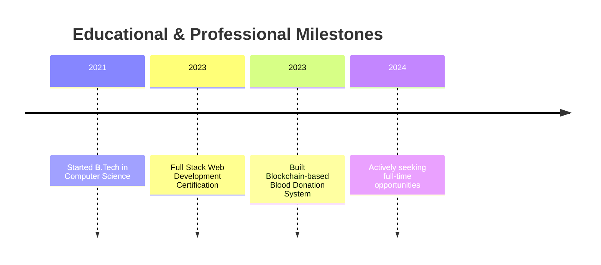

# 🌟 Manthri Vamshi | Java Full Stack Developer & Backend Enthusiast

  
  
  

    
    
    
  

## 💡 Mission Statement

> **Transforming complex business problems into elegant solutions through innovative Java development. Committed to creating efficient, scalable backend systems that make a real-world impact.**

## 🌟 About Me

<table>
  <tr>
    <td width="60%">
      
As a passionate Java Full Stack Developer in my final year of B.Tech, I combine technical expertise with creative problem-solving to build robust applications. My journey is driven by a deep fascination with backend technologies and a commitment to writing clean, maintainable code.

    </td>
    <td width="40%">
      <h3>🎓 Education</h3>
      <ul>
        <li>Bachelor of Technology in Computer Science</li>
        <li>Jayamukhi Institute of Technological Sciences</li>
      </ul>
    </td>
  </tr>
</table>

## 🚀 Quick Glimpse

<table>
  <tr>
    <td width="50%">
      <h3>🎯 Mission</h3>
      
Building robust backend systems that solve real-world challenges, with a focus on performance, security, and scalability.

    </td>
    <td width="50%">
      <h3>📊 At a Glance</h3>
      <ul>
        <li>🏆 Java Full Stack Developer</li>
        <li>🎓 Final Year CSE Student</li>
        <li>🌐 Blockchain Enthusiast</li>
      </ul>
    </td>
  </tr>
</table>

### 🔬 Skill Proficiency

| Skill Category | Proficiency | Highlights |
|---------------|-------------|------------|
| Core Java | ███████████████ 90% | OOP, Collections, Multithreading |
| Advanced Java | ██████████████ 85% | JSP, Servlets, Spring Boot |
| Web Development | ████████████ 75% | HTML, CSS, JavaScript |

## 🛠️ Technical Skills Visualization

  

### 🚀 Interactive Timeline

## 💼 Professional Experience

### 🚀 Trainee Java Full Stack Developer
*January 2023 - Present*

  
Key Accomplishments

  
  - 📈 Developed multiple web applications using Java, JSP, and Servlets
  - 🤝 Collaborated with cross-functional teams to deliver high-quality software
  - ⏱️ Implemented efficient database designs that improved query performance

### 🌐 Blockchain Development Project
*July 2023 - December 2023*

  
Key Achievements

  
  - 🎯 Successfully integrated Ethereum blockchain with Java backend
  - 🔒 Implemented secure smart contracts for donor verification
  - 🔍 Utilized IPFS for decentralized storage of critical medical data

## 📦 Featured Projects

  <table>
    <tr>
      <th>Project</th>
      <th>Description</th>
      <th>Technologies</th>
    </tr>
    <tr>
      <td>🔐 Blockchain-based Blood Donation System</td>
      <td>Decentralized application for secure blood donation management</td>
      <td>Java, JSP, Servlets, Ethereum, MySQL, IPFS</td>
    </tr>
    <tr>
      <td>🩺 Social Media Health Monitoring</td>
      <td>Analytics platform for public health trend predictions</td>
      <td>Java, TM-ATAM models, Twitter API</td>
    </tr>
  </table>

## 📈 GitHub Stats & Contributions

  
  
  
  

## 🏆 Achievements & Certifications

  <table>
    <tr>
      <th>Certification</th>
      <th>Issuing Organization</th>
      <th>Year</th>
    </tr>
    <tr>
      <td>🎯 Full Stack Web Development</td>
      <td>Edunet Foundation</td>
      <td>2023</td>
    </tr>
    <tr>
      <td>📚 AI/Cloud Virtual Internship</td>
      <td>Edunet Foundation</td>
      <td>2023</td>
    </tr>
    <tr>
      <td>🤖 Salesforce Developer</td>
      <td>Smart Internz</td>
      <td>2023</td>
    </tr>
    <tr>
      <td>🔒 Cybersecurity</td>
      <td>Career Dreams Foundation</td>
      <td>2022</td>
    </tr>
    <tr>
      <td>🧠 AIML in IoT</td>
      <td>NIT Warangal</td>
      <td>2022</td>
    </tr>
  </table>

## 🏆 Key Achievements Showcase

  <table>
    <tr>
      <td align="center">
        
      </td>
      <td align="center">
        
      </td>
    </tr>
  </table>

## 🌱 Currently Learning

  

Specific Focus Areas:
- Enterprise Java development using Spring Framework
- Microservices architecture and implementation
- Advanced blockchain development techniques
- Cloud deployment and containerization

## 🎲 Coding Quote

> "The best code is no code at all. Every line of code we write is a line we'll have to maintain." - Manthri Vamshi

  

## 💬 Let's Connect!

  
**Passionate about Java development, backend technologies, or blockchain? I'm always excited to collaborate and explore new opportunities!**

  
  
  

---

  
  
  **Thank you for visiting my profile. Stay curious, keep coding!** 😊

